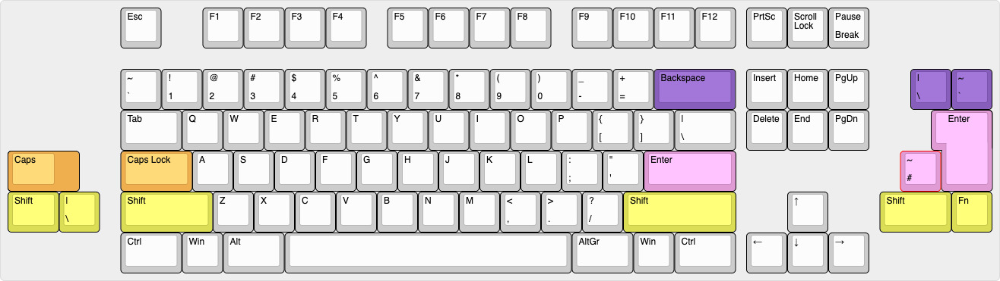
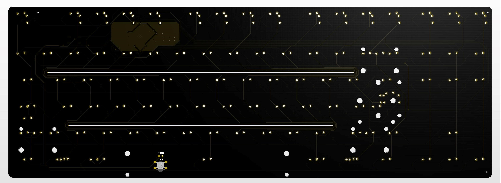
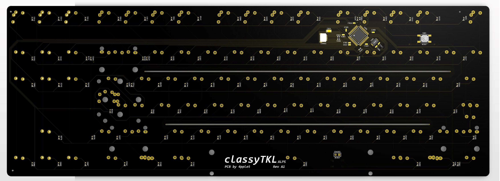
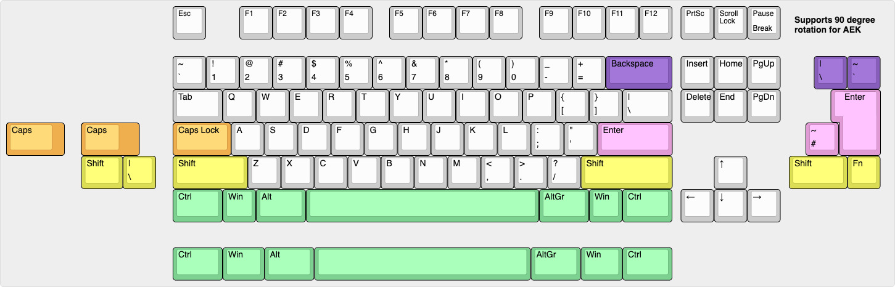

# classyTKL

PCB for the classyTKL

## Some features:
- QMK
- Cherry PCB-stab support
- JST-connector for daughter board

# classyTKL MX

## Altium view of MX PCB

## Layout support MX: 

## Revisions MX:
- Rev A1: Initial prototype
- Rev A2: Added missing ISO-shift

# classyTKL ALPS

## Altium view of MX PCB

## Layout support MX: 

## Revisions MX:
- Rev A1: Initial prototype

