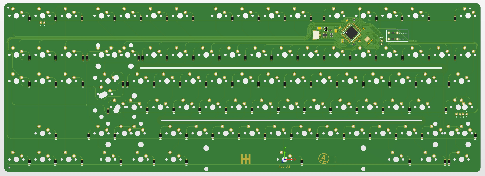
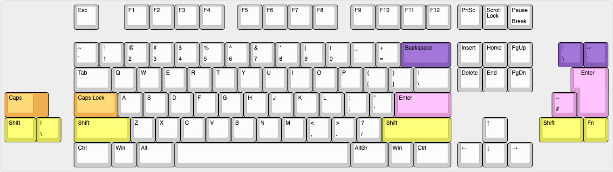

# classyTKL

PCB for the classyTKL

## Some features:
- QMK & VIA
- Cherry PCB-stab support
- JST-connector for daughter board
- Polyfuse for overcurrent protection
- ESD-protection
- Reset-switch under spacebar
- ISO & ANSI-support
- (rev A3) Reverse polarity protection

## Altium view of MX PCB

## Layout support: 

## Revisions MX:
- Rev A1: Initial prototype
- Rev A2: Added missing ISO footprint, added posibility of THT switch under space
- Rev A3: Made minor component changes, aligned look with Lewis PCB

## Revisions ALPS:
- Rev A1: Initial prototype
- Rev A3: Made minor component changes, aligned look with Lewis PCB

## Revisions SMK:
- Rev A1: Initial prototype
- Rev A2: Updated footprints that was still left over from MX-version
- Rev A3: Made minor component changes, aligned look with Lewis PCB

NOTE: ALPS and SMK ISO enter ONLY support center-stem (like MX), not offset stem.
