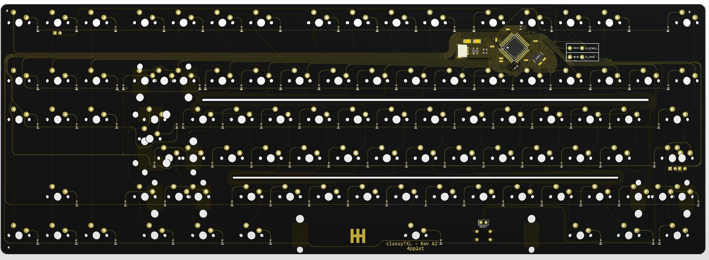
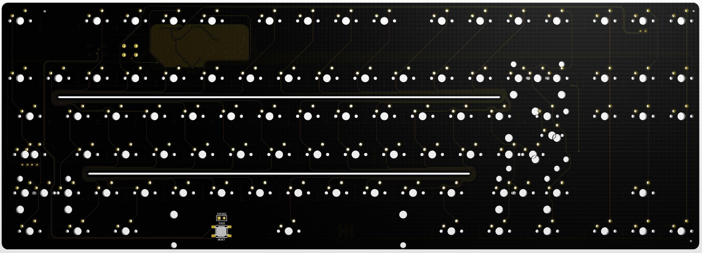
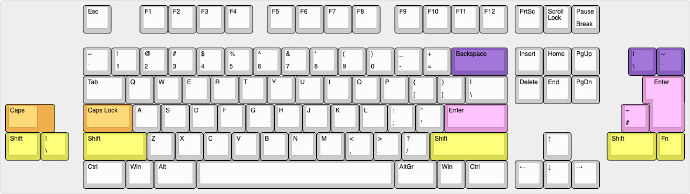

# classyTKL

PCB for the classyTKL

## Some features:
- QMK & VIA
- Cherry PCB-stab support
- JST-connector for daughter board
- Polyfuse for overcurrent protection
- ESD-protection
- Reset-switch under spacebar
- ISO & ANSI-support

## Altium view of PCB

## Layout support: 

## Revisions:
- Rev A1: Initial prototype
- Rev A2: Added missing ISO footprint, added posibility of THT switch under space
- Rev A3: Removed THT-holes for reset-switch for better compatibility with standard SMD soldering process.
