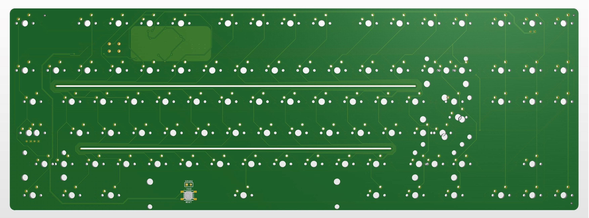
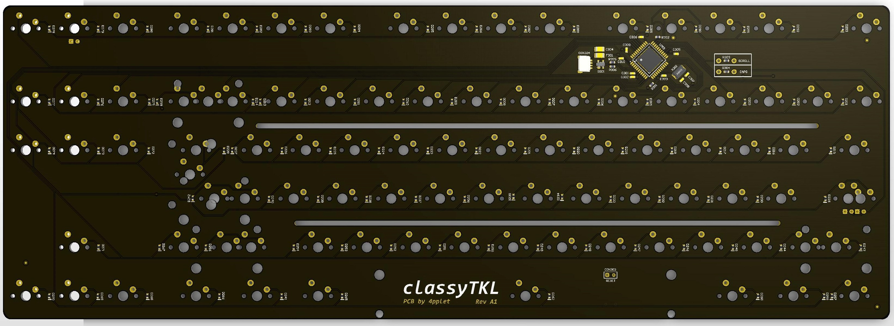
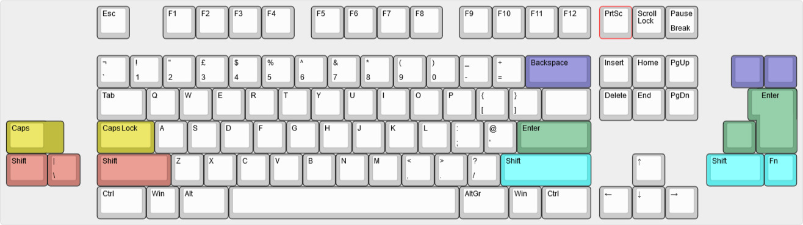

# classyTKL

PCB for the classyTKL

## Some features:
- QMK
- Cherry PCB-stab support
- JST-connector for daughter board

## Altium view of PCB

## Layout support: 

## Revisions:
- Rev A1: Initial prototype